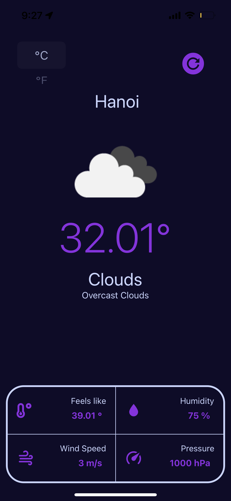

# Weather app

<gif src="assets/103912-purple.gif" />

**Highlights**

-   Use [OpenWeatherMap] API
-   Use current location data
-   Use MaterialCommunityIcons
-   Use FontAwesome5

**Demo** application is available in [Release]

**Screenshot**

 

**Credit**

### This app inspired from [Weather App] concept Designed by [Esteban Codes]
