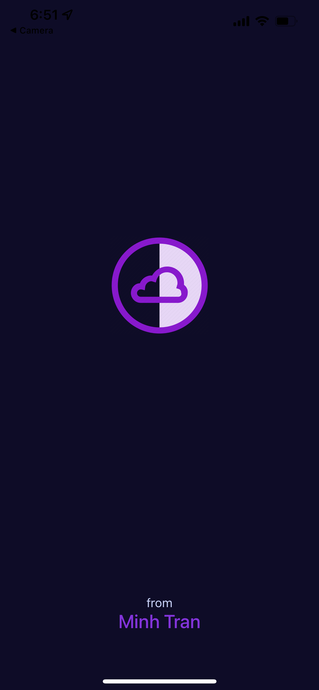
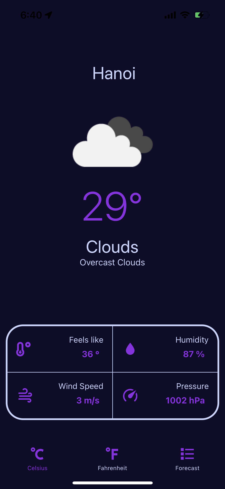
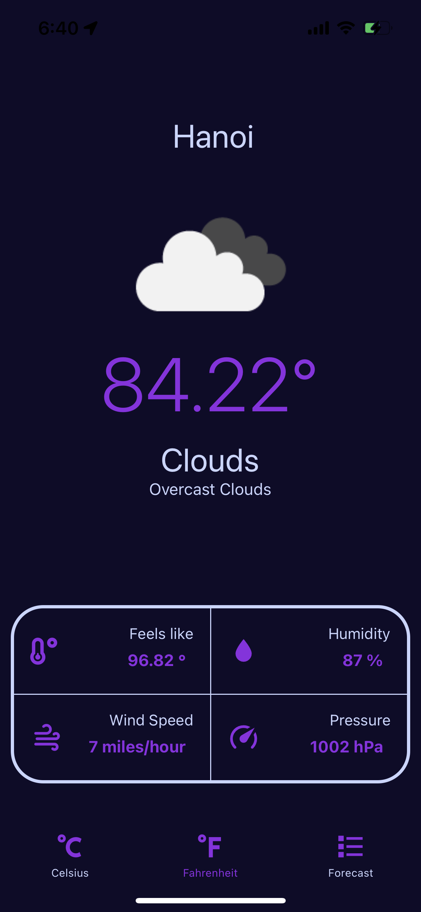
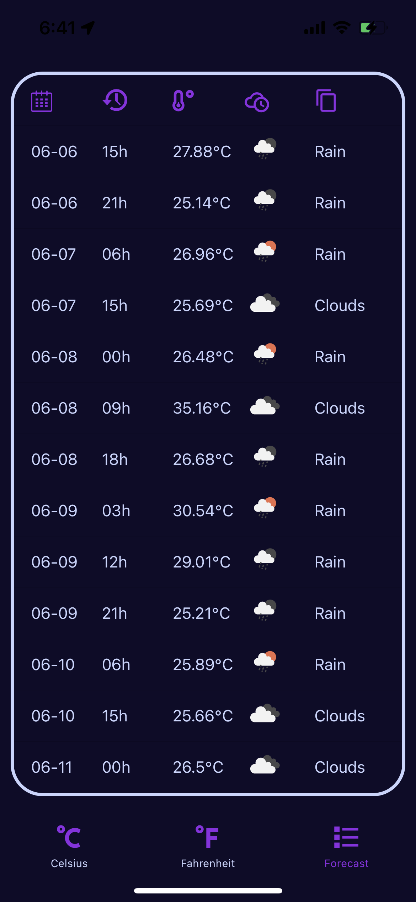
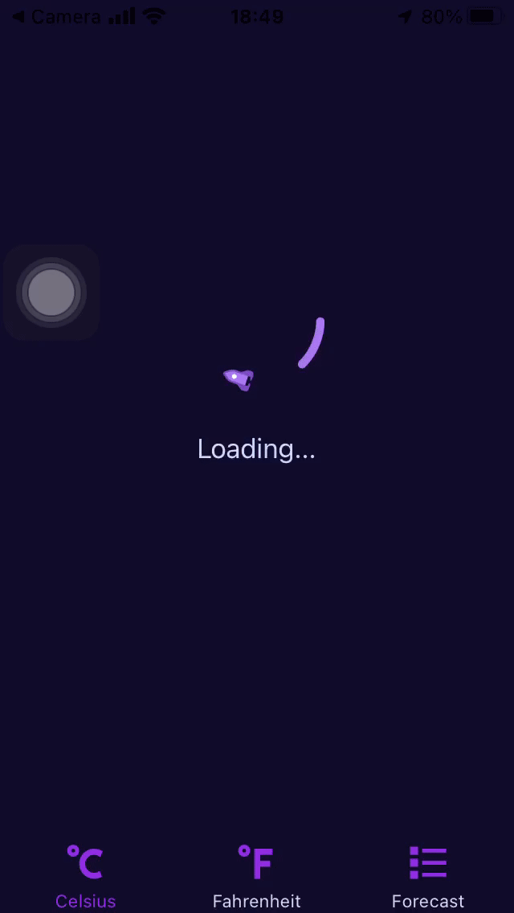

  

  <h3 align="center">Weathereader Mobile</h3>
  

     ☔️ Checking the weather without a window ☔️
     
     
    
    
    
    

  

   
    <a href="https://github.com/Power-Of-Words/PowerOfWordsProject/issues/new">Report bug</a>
    ·
    <a href="https://github.com/Power-Of-Words/PowerOfWordsProject/issues/new">Request feature</a>
  

## 𝌞 Table of contents

-   [Description](#description)
-   [Quick start](#quick-start)
-   [What's included](#whats-included)
-   [Bugs and feature requests](#bugs-and-feature-requests)
-   [Copyright and license](#copyright-and-license)

## 👾 Description

Weathereader-Mobile is a cross-platform mobile application designed to help users check weather in their current location. The app provide details about the current weather and the information within the next 5 days.

## 🏁 Quick start

This is an Expo app . You should follow the instructions in the [official website](https://expo.dev/).

## ？What's included

💥 Beautiful Loading Tab

💥 Temperature

💥 Weather Description

💥 Weather Status

💥 Feels like

💥 Humidity

💥 Wind Speed

💥 Pressure

💥 Forcast by time (within 5 days)

### 🤡 Icons

-   MaterialCommunityIcons
-   FontAwesome5
-   Entypo
-   Focustio

## 📸 Tabs

<table>
<tr>
<td>
</td>
<td>
</td>
<td>
</td>
<td>
</td>
</tr>
</table>

## 🔄 Loading

Loading Tab uses [Lottie Animation](https://docs.expo.dev/versions/latest/sdk/lottie/) 💥

## 🪳 Bugs and feature requests

Have a bug or a feature request? Please first read the [issue guidelines]() and search for existing and closed issues. If your problem or idea is not addressed yet, [please open a new issue](https://github.com/Power-Of-Words/PowerOfWordsProject/issues/new).

## 💪🏻 Contributing

Please read through our [contributing guidelines](). Included are directions for opening issues, coding standards, and notes on development.

## © Copyright and license

<!-- 
 -->

Code and documentation copyright 2022 by Minh Tran.   
  
Enjoy :metal:

<!-- 
 -->
